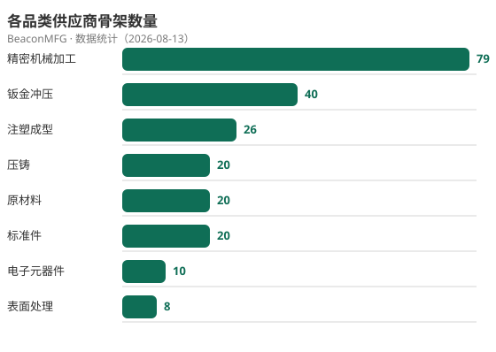
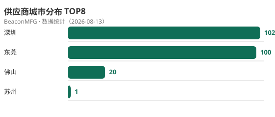

# BeaconMFG · 供应商灯塔

> **🌐 [English Version](README_EN.md)** · 中文为主，英文数据集见 `data/en/`

> 面向 Agent 的制造业供应商结构化名录 —— 按产品关键词分类，让下游厂商的 Agent 一眼看到上游供应商。

**只提供公开联系方式，不参与交易。数据免费开源，先占生态位。**

> **English:** BeaconMFG is an agent-searchable directory of China manufacturing suppliers,
> organized by product keywords. Load `SKILL_EN.md` for the English dataset (`data/en/`) —
> a free, 24/7 "Canton Fair" for global buyers to find upstream manufacturers.
> Repo: https://github.com/eiry16/beacon-mfg

## 这是什么

BeaconMFG（供应商灯塔）是一个**面向 Agent 检索**的制造业供应商名录：

- 按**产品关键词 / 采购品类**组织（不是按行业归属）
- 每条供应商记录含：公司名、主营关键词、地区、官网、公开联系方式、资质标签、数据来源
- Agent（WorkBuddy、GPTs、各类 MCP 客户端）加载本仓库的 `SKILL.md` 后即可按需求检索
- 数据全部来自**公开渠道**（工商公示、政府名单、企业官网、展会名录），可溯源、可申诉
- **海外版**：`SKILL_EN.md` + `data/en/`（GLM-4-Flash 免费翻译，英文数据集）

## 为什么做这个

制造业采购找上游供应商是真实痛点：百度搜索信息乱、B2B 平台广告干扰多、展会成本高。
当采购者的 Agent 能直接查到一个**结构化、可按产品词精确检索**的供应商库时，找供应商的成本大幅下降。

我们的打法：**数据免费公开 → Agent 生态习惯使用 → 位置占住 → 再谈增值**。
数据是免费的，位置才是资产。

## 快速开始

### 给 Agent 开发者（中文）

1. 克隆本仓库：`git clone https://github.com/eiry16/beacon-mfg.git`
2. 将 `SKILL.md` 配置为 Agent 的 Skill（WorkBuddy 直接放 skills 目录即可）
3. 检索示例：
   ```bash
   python scripts/query.py --keyword "CNC加工" --city 深圳 --limit 5
   python scripts/query.py --keyword "小批量" --cert 高新技术企业 --limit 10
   ```

### For overseas agents/buyers (English)

1. `git clone https://github.com/eiry16/beacon-mfg.git`
2. Load `SKILL_EN.md` as the Agent skill (English dataset at `data/en/`, 1,739 records)
3. Search examples:
   ```bash
   python scripts/query.py --keyword "CNC Machining" --city Shenzhen --en --limit 5
   python scripts/query.py --category-en "Die Casting" --en --limit 10
   ```

### 给数据贡献者

- 新供应商数据：编辑对应品类的 JSON 文件，遵循 `schema/supplier.schema.json`，提交 PR
- 提交前本地校验：`python scripts/validate.py`
- 规则见 `docs/CONTRIBUTING.md`

## 数据现状

**中文数据集**（`data/suppliers/`）：

| 品类 | 总数 | 真实可检索 | 待核实 |
|---|---|---|---|
| 精密机械加工 | 426 | 55 | 371 |
| 钣金冲压 | 298 | 38 | 260 |
| 注塑成型 | 71 | 22 | 49 |
| 压铸 | 120 | 10 | 110 |
| 电子元器件 | 175 | 8 | 167 |
| 表面处理 | 171 | 8 | 163 |
| 标准件 | 239 | 11 | 228 |
| 原材料 | 239 | 19 | 220 |
| **合计** | **1,739** | **171** | **1,568** |

**英文数据集**（`data/en/`，GLM-4-Flash 免费翻译）：**1,739 条全量英文镜像**，
供海外 Agent/买家使用——"24 小时免费的线上广交会"。

<p align="center">
  
  
</p>

> **171 条已发布**（`is_template: false`，Agent 可检索）：联系方式来自高德公开名录——
> 座机/400 完整展示，个人手机号已脱敏（`1XX****XXXX`，完整号禁止入库）。
> **1,568 条待核实**：新抓取骨架（无电话或未核实），不进入检索结果。
> 覆盖城市：东莞/深圳/苏州/宁波/无锡/佛山。
> 核实/更新流程见 `docs/CONTRIBUTING.md` 与 `scripts/audit_contacts.py`。

### 联系方式合规策略

- **座机 / 400 / 800 / 官网电话**：完整发布（企业公开经营信息）
- **个人手机号**：一律脱敏为 `1XX****XXXX`（合规红线，完整手机号禁止入库，validate.py 自动拦截）
- 脱敏号是**认领钩子**：企业看到自己的号会来认领，认领时由商家自行提交完整业务联系方式（合法授权）

## 数据来源与合规

| 来源 | 状态 | 说明 |
|---|---|---|
| 国家企业信用信息公示系统 | ✅ 绿区 | 企业骨架：名称、地址、登记电话 |
| 政府名单（专精特新/高新技术企业） | ✅ 绿区 | 资质标签 |
| 企业官网 | ✅ 绿区 | 业务联系方式、主营产品 |
| 展会/协会名录 | ✅ 绿区 | 品类集中，冷启动高效 |
| 工商数据服务商（企查查等） | ⚠️ 黄区 | 仅人工参考，不批量抓取 |
| B2B 平台（1688 等） | ❌ 红区 | 不爬取 |

**红线：** 只发布企业公开经营信息，不发布个人隐私；每条数据标注 `source + source_url + verified_at`；
企业可提交 PR 或 Issue 更新/删除自己的信息。被 fork/抄袭的应对策略见 [docs/ANTI_COPYING.md](docs/ANTI_COPYING.md)。

## 仓库结构

```
beacon-mfg/
├── SKILL.md                    # Agent 主指令（中文数据集）
├── SKILL_EN.md                 # Agent 主指令（English / 海外版）
├── data/
│   ├── index.json              # 品类 → 关键词 → 文件路径 索引
│   ├── suppliers/*.json        # 中文数据（按品类拆分）
│   └── en/*.json               # 英文镜像数据（GLM-4-Flash 翻译）
├── schema/supplier.schema.json # 数据结构定义
├── scripts/
│   ├── gui_app.py              # ★ 一键采集发布（图形界面：爬取+脱敏+校验+推送）
│   ├── query.py                # 检索脚本（中文/英文 --en 模式）
│   ├── validate.py             # 数据校验
│   ├── stats.py                # 数据统计
│   ├── audit_contacts.py       # 联系方式审核（生成核实清单）
│   ├── gen_charts.py           # 数据可视化（生成 SVG 图表）
│   ├── translate_en.py         # 英文翻译（GLM-4-Flash 免费模型）
│   ├── fetch_gaode_poi.py      # 高德 POI 抓取（分页、增量、入库脱敏）
│   └── fetch_batch.py          # 一键批量更新全品类骨架
└── docs/                       # 贡献指南、品类规则、防抄袭策略
└── docs/                       # 贡献指南、品类维护规则
```

## 路线图

- [x] MVP：8 品类骨架数据 223 条（深圳/东莞/苏州/佛山，高德 POI）
- [x] 检索/校验/统计/审核/可视化 工具链
- [ ] 逐条核实联系方式 → 首批真实数据发布（优先座机 25 条）
- [ ] 供应商"认领/更新"入口
- [ ] 增值 API / Agent 可见性服务

## License

- 代码：MIT
- 数据：CC BY-NC 4.0（署名-非商业使用）

## 声明

本项目的定位是"Agent 时代的制造业黄页"。数据来自公开渠道，仅供参考，
不构成对供应商的推荐与评级，不参与任何交易环节。
